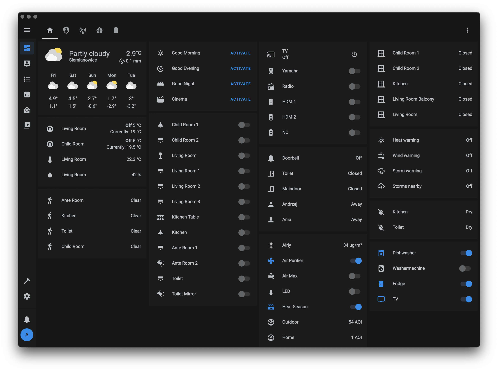
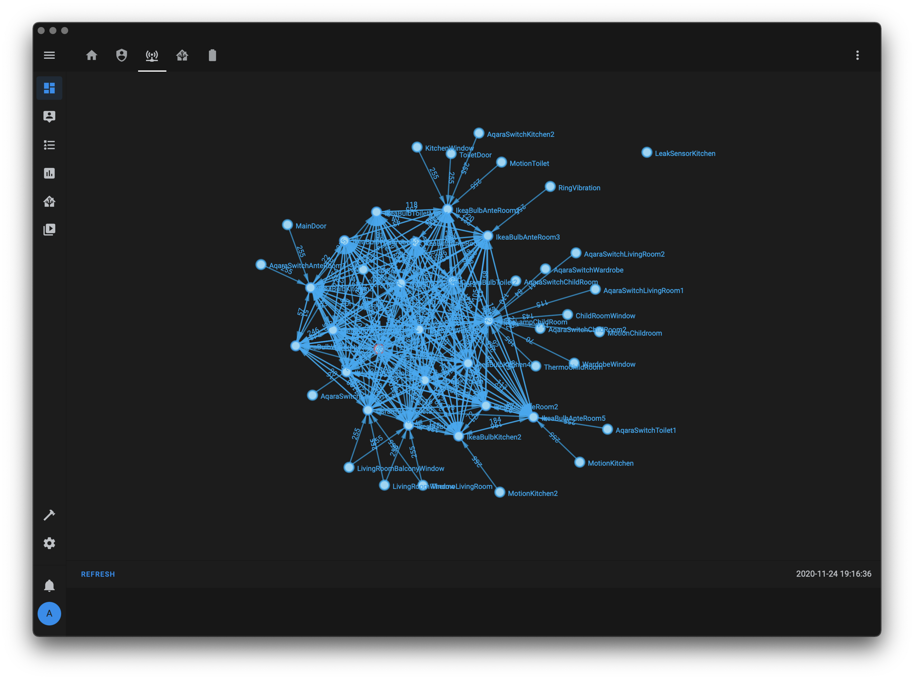

#  Home Assistant Configuration Files

## Server
* Intel NUC NUC7i3BNH, i3-7100U CPU 2.40GHz, 16GB RAM (Ubuntu Server)
* Home Assistant in Kubernetes instalation (Helm Charts)

## ZigBee Devices
### ZigBee Adapter 
* Texas Instruments LAUNCHXL-CC1352P-2

### Lights
* Aqara bulb ZNLDP12LM x1
* Ikea bulb GU10 LED1650R5 x11
* Ikea bulb LED1649C5 x4
* Ikea bulb RGB LED1624G9 x1
* Osam bulb RGB AC08559 x3

### Switches
* Aqara WXKG11LM x2
* Aqara WXKG03LM x4
* Aqara WXKG02LM x4

### Lock
* Danalock V3-BTZB x1

### Thermostat
* Eurotronic SPZB0001 x3

### Leak Sensor
* Aqara SJCGQ11LM x2

### Motion Sensor
* Aqara RTCGQ11LM x5

### Contact Sensor
* Aqara MCCGQ11LM x7

### Vibration Sensor
* Aqara DJT11LM x1

## Wifi Devices
### Power Plug
* BlitWolf BW-SHP6 x7 (eshome)
* Shelly 2.5 x2 (esphome)

### Air Purifier
* Xiaomi Air Purifier 2S x1

### IR Controller
* Xiaomi Universal IR x1

### Voice Assistant
* Amazon Echo Dot 3
* Siri (iPhone, Apple Watch)

### Media Player
* LG WebOS x1
* AppleTV 4K
* Amazon Echo Dot 3

## Integrations
* Mobile App (iPhone, Android, MacOS)
* MQTT
* HomeKit
* Airly
* Speedtest
* Alexa Media Player
* HACS
* Burze dziś

## Screenshots

